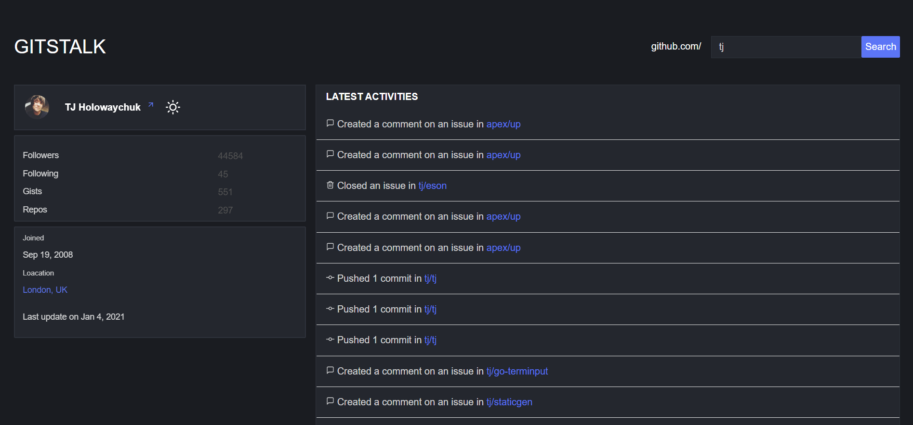

# [GITSTALK](http://gitstalk_clone.surge.sh/) 🔎

[](https://github.com/prettier/prettier)
[](https://github.com/styled-components/styled-components)

React project based learning app.



## Usage

```
npm install
npm start
```

## Credits

- [Abhishek Sharma](https://github.com/littlewonder) for creating original [gitstalk](https://github.com/littlewonder/gitstalk).
